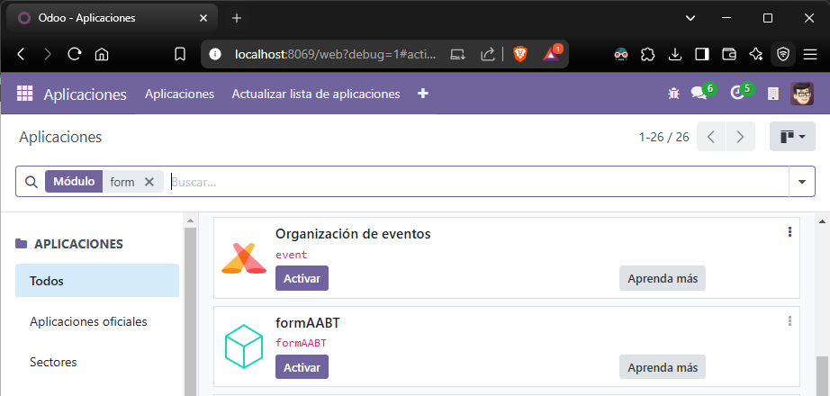
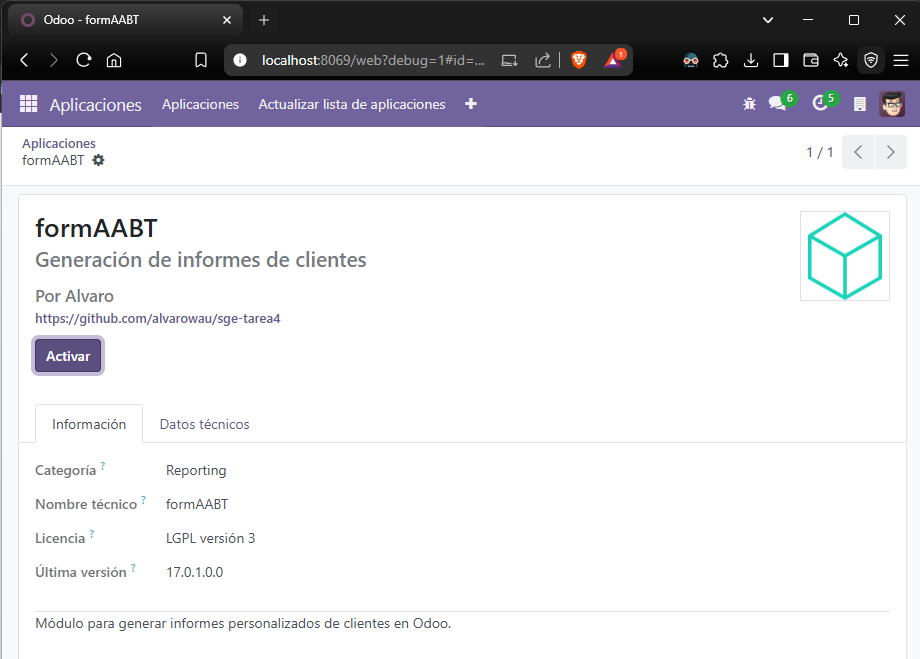
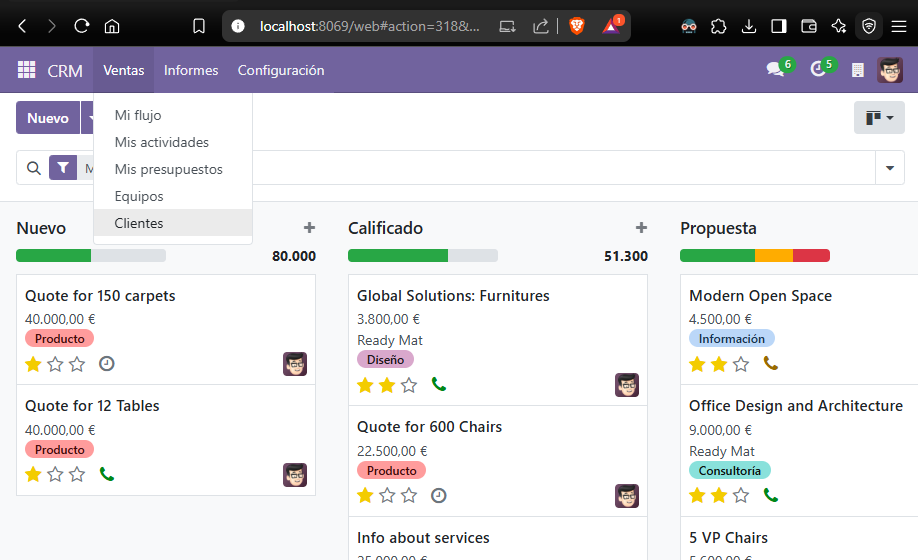
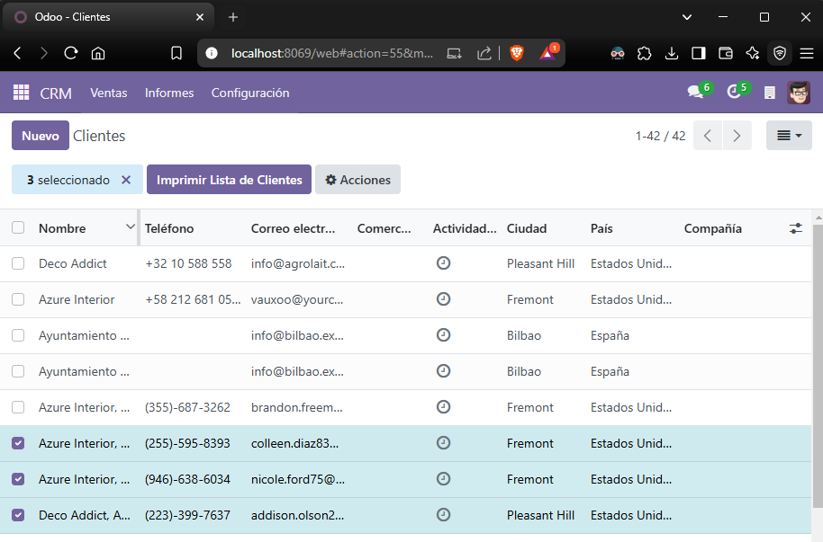
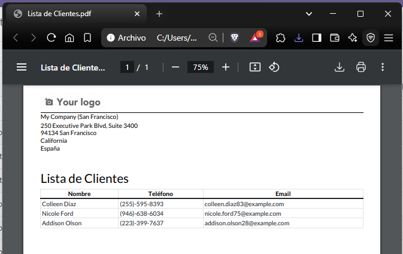

# Acceso al contenedor de Odoo

Para trabajar dentro del entorno de Odoo, se debe acceder al contenedor que contiene la instancia en ejecución:

```bash
docker exec -it sge-tarea5-web-1 bash
```

Dentro del contenedor, navegar hasta la carpeta donde se encuentran los módulos personalizados:

```bash
cd /mnt/extra-addons
```

# Creación del módulo "formAABB"

Dentro de la carpeta "extra-addons", se debe crear la estructura del módulo:

```bash
mkdir -p formAABB/views
touch formAABB/__init__.py formAABB/__manifest__.py
```

El archivo `__init__.py` se deja vacío inicialmente.

# Configuración del `__manifest__.py`

El archivo `__manifest__.py` define la configuración básica del módulo. Se debe editar y agregar el siguiente contenido:

```python
{
    'name': 'formAABB',
    'version': '1.0.0',
    'summary': 'Generación de informes de clientes',
    'description': 'Módulo para generar informes personalizados de clientes en Odoo.',
    'category': 'Reporting',
    'author': 'Alvaro',
    'license': 'LGPL-3',
    'website': 'https://github.com/alvarowau/sge-tarea4',
    'depends': ['base'],
    'data': [
        'views/report.xml',
        'views/res_partner_views.xml',
    ],
    'installable': True,
    'application': False,
}
```

# Creación del informe en `report.xml`

Dentro de la carpeta `views/`, se debe crear un archivo llamado `report.xml` que contendrá la definición del informe:

```xml
<?xml version="1.0" encoding="utf-8"?>
<odoo>
    <record id="action_report_customer_list" model="ir.actions.report">
        <field name="name">Lista de Clientes</field>
        <field name="model">res.partner</field>
        <field name="report_type">qweb-pdf</field>
        <field name="report_name">formAABB.report_customer</field>
        <field name="report_file">formAABB.report_customer</field>
    </record>

    <template id="report_customer">
        <t t-call="web.external_layout">
            <main>
                <div class="page">
                    <h2>Lista de Clientes</h2>
                    <table class="table table-sm">
                        <thead>
                            <tr>
                                <th>Nombre</th>
                                <th>Teléfono</th>
                                <th>Email</th>
                            </tr>
                        </thead>
                        <tbody>
                            <t t-foreach="docs" t-as="customer">
                                <tr>
                                    <td><t t-esc="customer.name"/></td>
                                    <td><t t-esc="customer.phone or ''"/></td>
                                    <td><t t-esc="customer.email or ''"/></td>
                                </tr>
                            </t>
                        </tbody>
                    </table>
                </div>
            </main>
        </t>
    </template>
</odoo>
```

# Integración del botón "Imprimir Lista de Clientes"

Se debe crear el archivo `res_partner_views.xml` dentro de `views/`:

```xml
<?xml version="1.0" encoding="utf-8"?>
<odoo>
    <record id="view_partner_tree_inherit_print_customer_list" model="ir.ui.view">
        <field name="name">res.partner.tree.inherit.print.customer_list</field>
        <field name="model">res.partner</field>
        <field name="inherit_id" ref="base.view_partner_tree"/>
        <field name="arch" type="xml">
            <xpath expr="//tree" position="inside">
                <header>
                    <button name="%(action_report_customer_list)d" string="Imprimir Lista de Clientes" type="action" class="oe_highlight"/>
                </header>
            </xpath>
        </field>
    </record>
</odoo>
```

# Instalación y prueba del módulo

Para activar el módulo `formAABB`, ejecutar:

```bash
odoo -u formAABB --stop-after-init
```

Luego, en la interfaz web de Odoo:

- Navegar a "Aplicaciones".
- Buscar "formAABB".




- Activar el módulo.
- Ir a "Clientes".
- Seleccionar los clientes que deseamos imprimir y hacer clic en "Imprimir Lista de Clientes".




- Visualizar el documento generado en PDF.



# Conclusión

Se ha implementado un informe personalizado en Odoo 17 dentro de un módulo ficticio llamado `formAABB`. Este informe permite generar un listado de clientes en formato PDF con su nombre, teléfono y correo electrónico. Además, se ha integrado un botón en la vista de clientes para facilitar su acceso. El listado de clientes se puede obtener desde la sección de contactos, ya que usa la misma vista.
