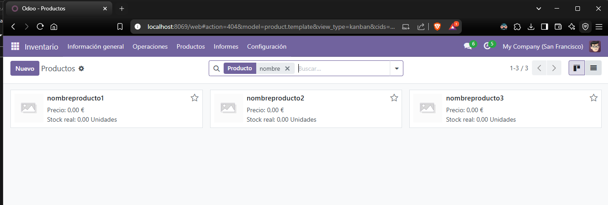

# Importación de Datos en Odoo 17

## 1. Creación del archivo CSV

Para realizar la importación de clientes en Odoo 17, se debe crear un archivo CSV con los datos de tres clientes arbitrarios. Asegúrese de que el archivo tenga las siguientes columnas mínimas:

| Nombre       | Teléfono     | Correo Electrónico    | Calle              | Ciudad   | C.P.  | País   |
|--------------|--------------|-----------------------|--------------------|----------|-------|--------|
| Juan Pérez   | +34123456789 | juan.perez@email.com   | Calle Falsa 123    | Madrid   | 28080 | España |
| María García | +34987654321 | maria.garcia@email.com | Avenida Gran Vía 45| Barcelona| 08001 | España |
| Carlos López | +34789456123 | carlos.lopez@email.com | Calle del Sol 78   | Valencia | 46001 | España |

Este archivo debe guardarse con codificación UTF-8 y con delimitador de coma (`,`) para evitar problemas de lectura en Odoo.

## 2. Importación del archivo CSV a Odoo

Siga estos pasos para importar los datos:

1. Acceder a **Contactos** en Odoo.
2. Hacer clic en el engranaje e **Importar registros**.

3. Hacer clic sobre **Subir archivo**, y seleccionar el archivo `.csv`.

4. Asegurarse de que las columnas estén correctamente mapeadas con los campos de Odoo:
   - Nombre → Nombre (name)
   - Teléfono → Teléfono (phone)
   - Correo Electrónico → Email (email)
5. Hacer clic en **Prueba** para comprobar la estructura del archivo.

6. Si no hay errores, hacer clic en **Importar**.
7. Ahora podemos asegurarnos de que se han creado los clientes.

## 3. Errores comunes y soluciones

Algunos problemas que encontré durante la importación fueron:
- La opción de **Título** en el archivo `clientes.csv` causó error constante y no pude exportarla.
- El campo **Provincia** también dio problemas, por lo que lo eliminé ya que no pude encontrar otra solución.

### Conclusión:
La importación de clientes en Odoo 17 se completó con éxito tras realizar los ajustes necesarios en el archivo CSV. Se aseguraron la correcta estructuración del archivo, el uso de la codificación UTF-8 y la eliminación de campos problemáticos como "Título" y "Provincia", que generaban errores durante la importación. Al mapear correctamente las columnas y realizar una prueba previa, se garantizó que los datos fueran interpretados adecuadamente por Odoo, logrando así una importación sin inconvenientes.

---

## b) Importación de Productos en Odoo 17

### Proceso de importación y errores detectados:

Para la importación de productos en Odoo, se utilizó un archivo CSV proporcionado por el docente. Sin embargo, durante el intento de carga, se identificaron varios errores que impedían la correcta importación de los datos. A continuación, se detallan los problemas encontrados y las soluciones implementadas.

### Archivo CSV inicial:

| Código | Nombre           | Categoría | Descripción          | Método abastecimiento | Método coste | Método suministro | Precio coste | Precio de venta | Puede ser comprado | Puede ser vendido | Tipo de producto | Empresas/Empresa | Impuestos cliente | Impuestos proveedor | UdM de compra | UdM por defecto |
|--------|------------------|-----------|----------------------|-----------------------|--------------|-------------------|--------------|-----------------|---------------------|-------------------|------------------|------------------|-------------------|---------------------|----------------|-----------------|
| cod1   | nombreproducto1   | cosmética | descripción producto 1 | make_to_order         | standard     | buy               | 0            | 0               | TRUE                | TRUE              | product          | Empresa demo      | IVA 21%            | 21% IVA Soportado   | Kg.            | Kg.             |
| cod2   | nombreproducto2   | cosmética | descripción producto 2 | make_to_stock         | standard     | buy               | 0            | 0               | TRUE                | TRUE              | product          | Empresa demo      | IVA 21%            | 21% IVA Soportado   | Kg.            | Kg.             |
| cod3   | nombreproducto3   | cosmética | descripción producto 3 | make_to_order         | standard     | buy               | 0            | 0               | TRUE                | TRUE              | product          | Empresa demo      | IVA 21%            | 21% IVA Soportado   | Kg.            | Kg.             |

### Errores encontrados:

- **Campos no reconocidos por Odoo**: Algunos nombres de columnas no coincidían con los requeridos por el sistema, lo que provocaba errores de reconocimiento. Los campos problemáticos fueron:
  - "Código"
  - "Categoría"
  - "Método abastecimiento"
  - "Método coste"
  - "Método suministro"
  - "Precio coste"
  - "Empresas/Empresa"
  - "UdM por defecto"

#### Causas de los errores:
- Los nombres de las columnas no correspondían con los utilizados en la estructura de datos de Odoo.
- Algunos campos no son necesarios o tienen una configuración diferente en Odoo.
- La categoría "cosmética" no existía en el sistema, lo que generaba un error durante la importación.

#### Soluciones aplicadas:

- **Corrección de nombres de los campos**: Se ajustaron los nombres de las columnas según la estructura de Odoo:
  - "Código" → Eliminado (Odoo utiliza el campo ID para identificar productos).
  - "Método abastecimiento" y "Método suministro" → Eliminados (no son relevantes para la importación estándar de productos).
  - "Empresas/Empresa" → Eliminado (Odoo asigna automáticamente la empresa según la configuración del usuario que realiza la importación).
  - "UdM por defecto" → Reemplazado por "Unidad de medida".

- **Creación de la categoría "cosmética" en Odoo**: Se agregó manualmente antes de la importación para evitar errores.

### Archivo CSV final ajustado:

| Nombre          | Categoría de producto | # Productos | Coste | Precio de venta | Puede ser comprado | Puede ser vendido | Tipo              | Impuestos cliente     | UdM de compra |
|-----------------|-----------------------|-------------|-------|-----------------|---------------------|-------------------|-------------------|----------------------|---------------|
| nombreproducto1 | cosmética             |             | 0     | 0               | True                | True              | Producto almacenable| IVA 21% (Bienes)     | Unidades      |
| nombreproducto2 | cosmética             |             | 0     | 0               | True                | True              | Producto almacenable| IVA 21% (Bienes)     | Unidades      |
| nombreproducto3 | cosmética             |             | 0     | 0               | True                | True              | Producto almacenable| IVA 21% (Bienes)     | Unidades      |

### Para agregar el CSV en Odoo, seguimos los siguientes pasos:

1. Nos dirigimos a **Inventario**.
2. Seleccionamos **Productos**.
3. Sobre el ícono del engranaje (configuración), damos clic en **Importar registros**.

4. Seguimos los mismos pasos que en la importación anterior para subir el archivo `.csv`.
5. En esta vista, damos clic en **Probar** para asegurarnos de que no haya errores.
6. Si no se detectan errores, damos clic en **Importar**.

7. Finalmente, buscamos el nombre de los productos en la lista para verificar que se hayan generado correctamente.

### Resultados de la importación:

Tras realizar las modificaciones en el archivo CSV, la importación en el módulo "Inventario" de Odoo se realizó sin inconvenientes, permitiendo cargar correctamente los productos.

### Conclusión:

La importación de productos en Odoo requiere que el archivo CSV cumpla con la estructura y nomenclatura esperada por el sistema. Los principales errores surgieron por nombres de columnas incorrectos y la ausencia de una categoría previamente definida. Tras los ajustes en los nombres de los campos y la creación de la categoría "cosmética", la importación se completó exitosamente sin errores. Esto demuestra la importancia de revisar la documentación de Odoo antes de realizar una carga masiva de datos.
