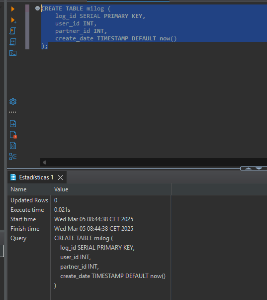
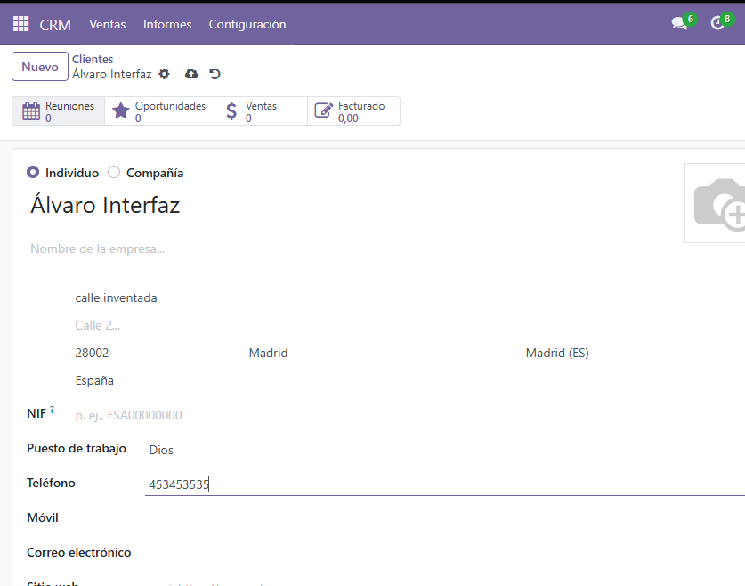

# Procedimiento y Trigger para la Auditoría de Clientes en Odoo

## a) Creación de un procedimiento para obtener información de un cliente

Para crear un procedimiento que muestre el nombre, la provincia y el país de un cliente determinado, utilizamos la siguiente consulta:

```sql
CREATE OR REPLACE FUNCTION get_cliente_info(p_cliente_id INT)
RETURNS TABLE (
    nombre VARCHAR,
    provincia VARCHAR,
    pais VARCHAR
) AS $$
BEGIN
    RETURN QUERY
    SELECT
        rp.name::VARCHAR AS nombre,
        s.name::VARCHAR AS provincia,
        c.name::VARCHAR AS pais
    FROM res_partner rp
    LEFT JOIN res_country_state s ON rp.state_id = s.id
    LEFT JOIN res_country c ON rp.country_id = c.id
    WHERE rp.id = p_cliente_id;
END;
$$ LANGUAGE plpgsql;
```


## b) Creación de un trigger para almacenar datos en la tabla “milog”

### 1. Creación de la tabla `milog`

```sql
CREATE TABLE milog (
    log_id SERIAL PRIMARY KEY,
    user_id INT,
    partner_id INT,
    create_date TIMESTAMP DEFAULT now()
);
```



### 2. Creación de la función que se ejecutará con el trigger

```sql
CREATE OR REPLACE FUNCTION log_new_client()
RETURNS TRIGGER AS $$
BEGIN
    INSERT INTO milog (user_id, partner_id, create_date)
    VALUES (NEW.create_uid, NEW.id, now());
    RETURN NEW;
END;
$$ LANGUAGE plpgsql;
```


### 3. Creación del trigger que se activa con la inserción de nuevos clientes

```sql
CREATE OR REPLACE TRIGGER trg_log_new_client
AFTER INSERT ON res_partner
FOR EACH ROW
EXECUTE FUNCTION log_new_client();
```


## c) Verificación de la tabla `milog`

### Creación de un cliente desde la interfaz de Odoo

Cuando se crea un cliente desde la interfaz de Odoo, el trigger se activa y registra la información en la tabla `milog`.



### Creación de clientes desde un archivo CSV

Los siguientes datos de clientes se utilizarán para la importación:

```csv
Nombre,Teléfono,Correo Electrónico,Calle,Ciudad,C.P.,País
Ana Martínez,+34911222333,ana.martinez@email.com,Calle Luna 34,Sevilla,41001,España
Luis Fernández,+34944555666,luis.fernandez@email.com,Calle Estrella 56,Zaragoza,50001,España
Sofía Ruiz,+34977888999,sofia.ruiz@email.com,Calle Marte 78,Málaga,29001,España
Jorge Gómez,+34900111222,jorge.gomez@email.com,Calle Júpiter 90,Bilbao,48001,España
```


### Creación de un cliente mediante SQL

```sql
INSERT INTO res_partner (name, create_uid, create_date, email, phone)
VALUES ('Álvaro sql', 1, NOW(), 'alvaro-sql@gmail.com', '3454645');
```


### Verificación de los registros en la tabla `milog`

```sql
SELECT * FROM milog;
```


## Conclusión

El ejercicio permitió explorar la actualización masiva de datos en pgAdmin4 mediante la creación de un procedimiento almacenado, un trigger y la verificación de registros en la tabla de auditoría "milog".

1. **Procedimiento almacenado**: Se diseñó una función en PL/pgSQL para obtener la información relevante de un cliente específico, mostrando su nombre, provincia y país.

2. **Trigger de auditoría**: Se implementó un trigger que automáticamente registra en la tabla "milog" información básica de cada cliente nuevo. Este mecanismo asegura la trazabilidad de los registros sin intervención manual.

3. **Verificación**: Se verificó el correcto funcionamiento del trigger mediante pruebas en tres escenarios:
   - Creación de clientes desde la interfaz de Odoo.
   - Importación masiva desde un archivo CSV.
   - Inserción directa mediante SQL.

Los resultados confirmaron que el trigger funciona correctamente en todas las situaciones evaluadas, garantizando el control efectivo sobre los datos ingresados y asegurando una mejor gestión de los registros en la base de datos de Odoo.
